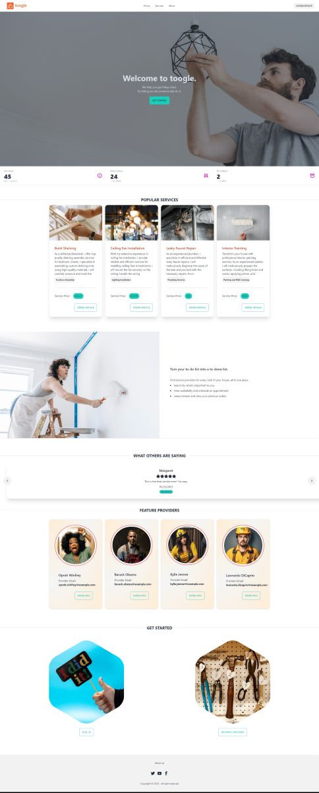
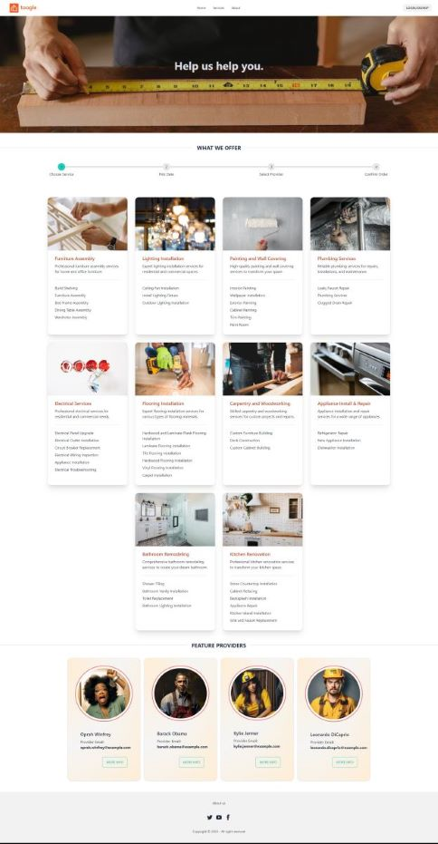

# toogle
toogle is an online platform that connects users with service providers for various services. It allows users to browse different categories of services, view service details, and make service bookings. Service providers can showcase their services, manage their availability, and interact with users.

# toogle on heroku:
[toogle.herokuapp.com](https://toogle.herokuapp.com/)

# Screen Prints:
  

# Team Members:

- Amy Metheny
- Arlindo Pinto
- Mirek Nyzio
- Parankush Somraj
- Tzvi Neiman

# Technologies Used:

### Frontend
- react
- react-datepicker
- tailwind-css
- daisyui
- jwt-decode

### Backend
- MongoDB
- Apollo-server
- Bcrypt
- Graphql
- Jsonwebtoken
- Mongoose
- nodemon

# About Us
